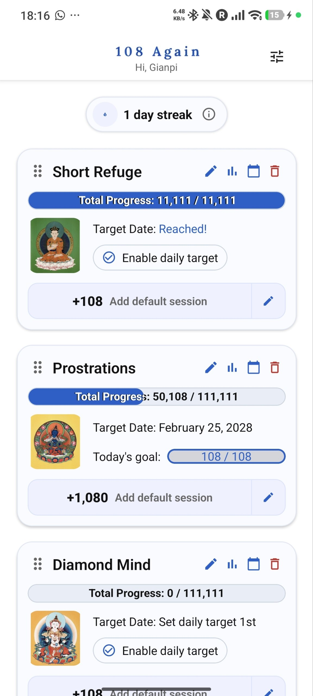
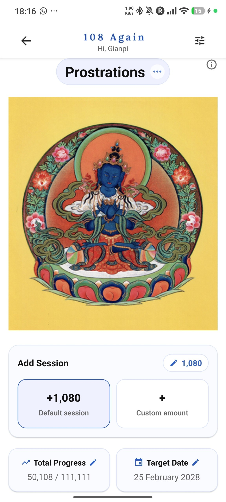
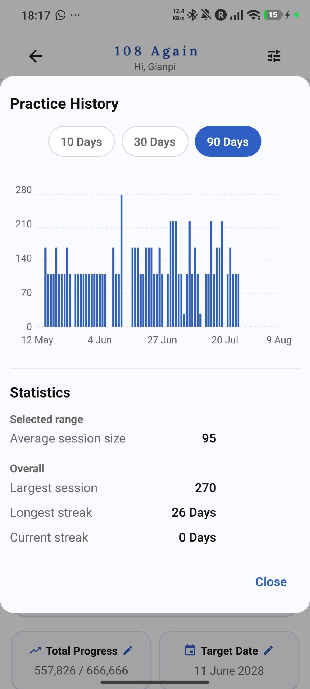
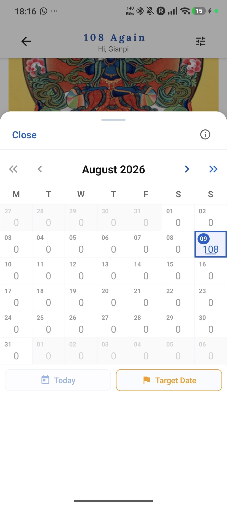
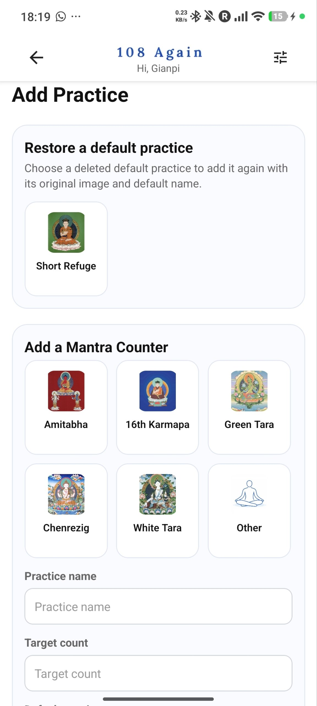
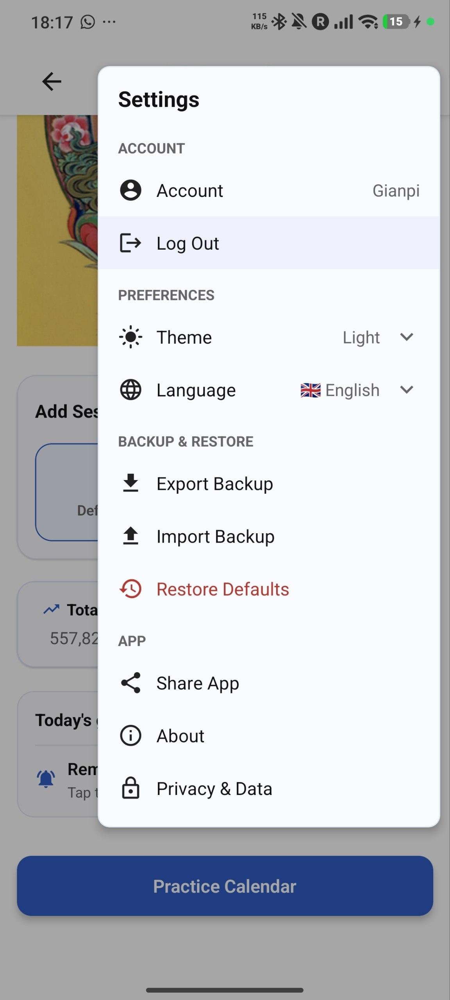
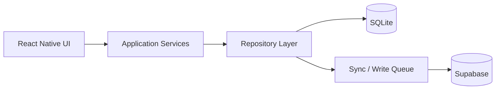

# 108 Again

An offline-first mobile application for tracking long-term meditation practices, built with **React Native, TypeScript, Expo, SQLite, and Supabase**.

I designed and developed 108 Again end-to-end, including its application architecture, mobile UI, local persistence, optional cloud synchronization, statistics, calendar-based tracking, backup and restore, account management, and production release.

[View 108 Again on Google Play](https://play.google.com/store/apps/details?id=com.bandieramonte.app108again)

---

## Tech Stack

**React Native · TypeScript · Expo · Expo Router · SQLite · Supabase**

The application is designed around a local-first architecture: users can continue recording and reviewing their practice data without a network connection, while authenticated users can optionally synchronize their data across devices.

---

## Screenshots

<p align="center">
  
  &nbsp;&nbsp;
  
  &nbsp;&nbsp;
  
</p>

<p align="center">
  <em>Dashboard, practice tracking, and historical statistics</em>
</p>

<p align="center">
  
  &nbsp;&nbsp;
  
  &nbsp;&nbsp;
  
</p>

<p align="center">
  <em>Calendar tracking, practice management, and application settings</em>
</p>

---

## Engineering Highlights

- **Offline-first data model** backed by SQLite
- Optional **Supabase authentication and cloud synchronization**
- Repository-based persistence layer separating application logic from storage
- Write queue for reliable synchronization
- Mutex-protected database writes
- Soft-delete synchronization
- Responsive React Native UI for phones and tablets
- Practice-history analytics and chart visualization
- Calendar-based session tracking and editing
- JSON backup, import, validation, and versioning
- Account and data-management functionality
- Automated application and synchronization tests
- Continuous integration through GitHub Actions

---

## Features

### Practice Management

Users can:

- Track multiple meditation practices
- Add, edit, remove, and restore practices
- Record repetitions using default or custom session amounts
- Reorder practices
- Track cumulative progress toward long-term targets
- Set daily targets
- Estimate completion dates
- Navigate between individual practice views

### Progress Tracking

108 Again provides:

- Overall progress visualization
- Daily goal tracking
- Target-date calculation
- Practice streak tracking
- Practice history
- Historical statistics
- Session-size analytics
- Calendar-based activity visualization
- Celebration feedback when targets are reached

### Calendar

Practice sessions can be reviewed through an interactive calendar that supports:

- Monthly navigation
- Daily repetition totals
- Session review and editing
- Current-date navigation
- Target-date visualization

### History and Analytics

Users can inspect their practice history over different periods and review statistics such as:

- Average session size
- Largest session
- Current streak
- Longest streak
- Daily activity over time

### Backup and Restore

Practice data can be exported and restored using JSON backups.

The backup system includes:

- Export
- Import
- Validation
- Backup-version handling
- Error handling

### Accounts and Cloud Sync

Cloud functionality is optional.

Authenticated users can synchronize practice data with Supabase while the application continues to use SQLite as its local data store.

Account-related functionality includes:

- Authentication
- Synchronization
- Account information
- Logout
- Privacy and data controls
- Account deletion

### User Experience

The application also includes:

- Responsive layouts for phones and tablets
- Touch-friendly controls
- Light/dark theme support
- Language preferences
- Modal-based secondary workflows
- Practice imagery
- Header and gesture-based navigation

---

## Architecture

108 Again separates UI, application behavior, persistence, and synchronization responsibilities.



### Local-first Design

SQLite is the primary local persistence mechanism.

Core functionality remains available locally rather than requiring every user action to depend on a remote API.

Cloud synchronization is an additional capability rather than a prerequisite for using the application.

### Repository Layer

Persistence responsibilities are separated into repositories for different parts of the application's data model, including:

- Practices
- Sessions
- User profile
- Deleted records
- Application metadata
- Dashboard queries

This keeps database operations separated from presentation components and higher-level application behavior.

### Local Database

The SQLite database includes data for:

- `practices`
- `sessions`
- `deleted_records`
- `profile`
- `app_meta`

### Remote Data

Supabase stores synchronized user data including:

- Practices
- Sessions
- User profiles

---

## Synchronization

Synchronization was designed around the application's offline-first requirements.

The implementation includes:

- A write queue
- Mutex-protected writes
- Soft-delete synchronization
- Remote synchronization through Supabase
- Cleanup of synchronized deleted records

This allows local changes to be recorded independently of immediate network availability and synchronized when cloud functionality is available.

---

## Testing

The repository contains separate automated tests for application behavior and synchronization behavior.

Run application tests:

```bash
npm run test:app
```

Run synchronization integration tests:

```bash
npm run test:sync
```

Run the complete test suite:

```bash
npm run test:ci
```

Lint the project:

```bash
npm run lint
```

The repository also includes a GitHub Actions workflow for automated synchronization testing.

---

## Project Structure

The codebase is organized around distinct application responsibilities:

```text
108-Again/
├── app/                 # Expo Router screens and routes
├── components/          # Reusable React Native UI components
├── constants/           # Application constants
├── database/            # SQLite database infrastructure
├── hooks/               # React hooks
├── i18n/                # Internationalization
├── lib/                 # Shared infrastructure
├── models/              # Application models
├── repositories/        # Persistence abstraction
├── services/            # Application and synchronization services
├── styles/              # Shared styling
├── supabase/            # Supabase-related functionality
├── tests/
│   ├── app/             # Application behavior tests
│   └── sync/            # Synchronization tests
├── types/               # TypeScript types
└── utils/               # Shared utilities
```

---

## Getting Started

### Prerequisites

- Node.js
- npm
- Expo development environment
- Android Studio and/or Xcode when running native builds

### Install Dependencies

```bash
npm install
```

### Start Expo

```bash
npx expo start
```

or:

```bash
npm start
```

### Run on Android

```bash
npx expo run:android
```

### Run on iOS

```bash
npx expo run:ios
```

### Clear the Expo Cache

```bash
npx expo start -c
```

---

## Product Context

108 Again was created for practitioners performing **Ngöndro and other repetition-based meditation practices**, where progress can involve tens or hundreds of thousands of repetitions over extended periods.

The application is intended to make that long-term process easier to manage without making connectivity or cloud accounts mandatory.

This required solving product and engineering problems around:

- Fast session entry
- Long-lived local data
- Offline operation
- Progress calculations
- Historical tracking
- Data portability
- Optional cross-device synchronization
- Mobile usability
- Reliable state transitions between local and remote data

---

## What This Project Demonstrates

108 Again is an independently developed application and represents end-to-end ownership of a React Native product—from product decisions and frontend implementation through persistence, synchronization, testing, and release.

From an engineering perspective, the project demonstrates work with:

- React Native and TypeScript
- Mobile product development
- Component-based UI architecture
- Local-first application design
- Relational persistence with SQLite
- Cloud integration with Supabase
- Authentication
- Synchronization and conflict-sensitive data flows
- Repository and service abstractions
- Data visualization
- Responsive mobile/tablet interfaces
- Automated testing
- Production deployment

---

## Developer

**Gian Piero Bandieramonte**  
Senior Software Engineer

Professional experience includes full-stack product development, React applications, API integrations, fintech, payments, and trading systems.

- Portfolio: https://www.bandieramonte.com/
- LinkedIn: https://www.linkedin.com/in/gbandieramonte/
- GitHub: https://github.com/bandieramonte

For examples of my commercial engineering work—including React platform modernization and fintech/trading systems—see my professional portfolio.

---

## Android App

108 Again is available on Google Play:

**[View 108 Again on Google Play](https://play.google.com/store/apps/details?id=com.bandieramonte.app108again)**
